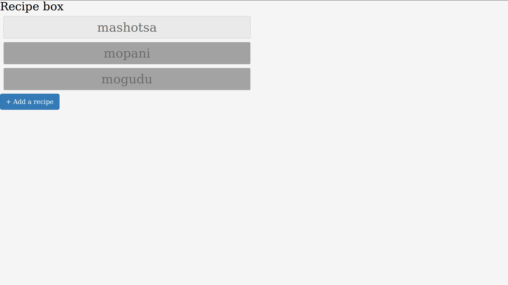

#Introduction
Building a react recipe box, the forth react project on free code camp, I must say this project

is one of the most challenging so far, but after completing it I have learned so much from this

project. I am going to take you on little journey of how i managed to complete the project and what I have

learned.

## Design and the initial implementation

In order to complete the project we are given a an example to look at and

a bunch of user stories to fulfill,now I wont go into details to what they are

but I must say when working on project its important to look them up and make sure your

project caters for them.I went on and took look at the given a project example and I could see

that they were pop-ups and nicely ordered buttons with recipe names, you can click on that button and it will

collapse showing the ingredients.

React Bootstrap came in use full here I use the Modal , Form and buttons for this project



---

# Storing the recipes in the browser with localStorage

now that the initial design was complete it is time for the good stuff now.

Since we should be storing the user's date (recipes) in the browser I had to go and look up

<strong>on LocalStorage/Window.LocalStorage if you like, according you the mdn web docs</strong>:
_The read-only localStorage property allows you to access a Storage object for the Document's origin; the stored data is saved across browser sessions. localStorage is similar to sessionStorage, except that while data stored in localStorage has no expiration time, data stored in sessionStorage gets cleared when the page session ends — that is, when the page is closed._

To set the localStorage in you can use

```
localStorage.setItem("name",item)

to get the item
localStorage.getItem("name",item)

to clear
localStorage.clear();
```

if you look at the image below you will see that I have a modal containing a form where the user

enters in her recipes and ingredients,that data is stored in the browser and can be accessed anytime

---


---

## What I learned from this project

One of the important things I learned in this project is that

When you working with react its actually important to use state

avoid global variables, you just use state.

this.sestate allows the component to re render every time the state changes this is extremely use full.
